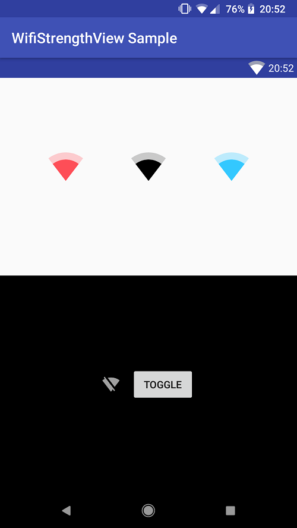

# WifiSignalStrengthView

A simple, customizable View that draws a wifi signal strength indicator.



## Attributes

```xml
<at.robhor.wifisignalstrength.WifiSignalStrengthView
    android:layout_width="wrap_content"
    android:layout_height="wrap_content"
    app:fillColor="#ffffff"
    app:backgroundColor="#a0ffffff" />
```

| attribute       | type     | default   | description |
| --------------- | -------- | --------- | ----------- |
| fillColor       | color    | black     | Foreground color of the shape                                                                                    |
| backgroundColor | color    | 50% black | Background color of the shape                                                                                    |
| autoUpdating    | boolean  | true      | If `true`, updates automatically based on wifi signal strength                                                   |
| wifiOff         | boolean  | false     | If `autoUpdating` is `false`, determines if the icon shows wifi as disabled                                      |
| fill            | fraction | 0.8       | If `autoUpdating` is `false`, determines how much of the wifi icon is filled, indicating signal strength (0 - 1) |
